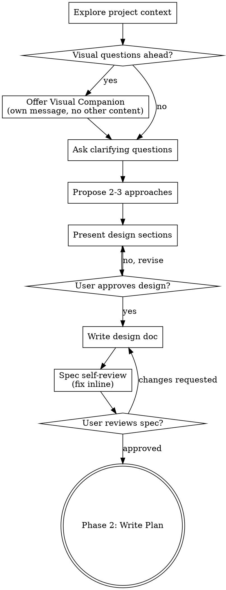
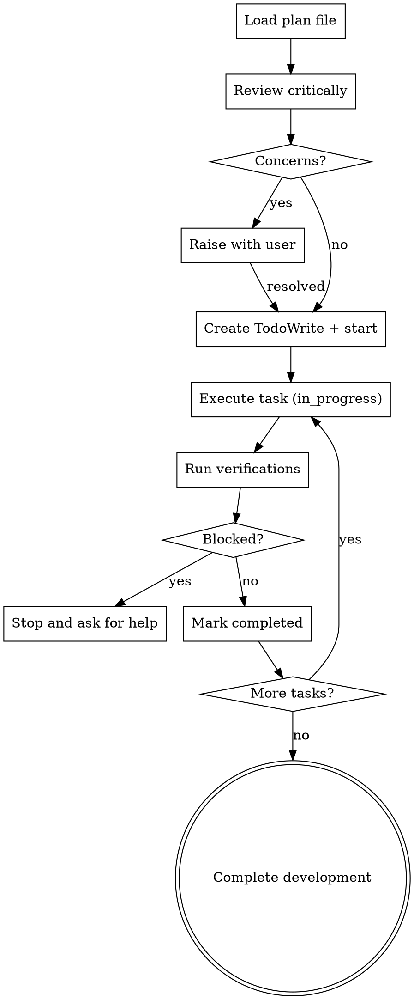

> **繁體中文說明**：此 skill 整合了完整設計流程（探索需求 → 撰寫計畫 → 執行計畫），見 [SUPERPOWERS-EXTRAS-USAGE-zh-TW.md](../SUPERPOWERS-EXTRAS-USAGE-zh-TW.md)（全系列 `sp-*` 摘要）。

# Design Workflow

## Overview

This skill covers the full think → plan → execute cycle for any creative or multi-step implementation work:

- **Phase 1 (Brainstorm):** Explore user intent, requirements, and design through collaborative dialogue. Produce an approved spec document.
- **Phase 2 (Write Plan):** Convert the approved spec into a bite-sized, fully detailed implementation plan. Produce a plan document.
- **Phase 3 (Execute Plan):** Load the plan, review critically, execute all tasks with checkpoints, and report completion.

<HARD-GATE>
Do NOT write any code, scaffold any project, or take any implementation action until Phase 1 has produced an approved spec and Phase 2 has produced a written plan. This applies to every project regardless of perceived simplicity.
</HARD-GATE>

---

## Phase 1: Brainstorm

**INPUT:** A user idea, feature request, or change description — however vague.

**OUTPUT:** An approved spec document saved to `docs/superpowers/specs/YYYY-MM-DD-<topic>-design.md`, committed to git, and explicitly approved by the user.

**Announce at start:** "I'm using the design skill — starting Phase 1: Brainstorm."

### Anti-Pattern: "This Is Too Simple To Need A Design"

Every project goes through this phase. A todo list, a single-function utility, a config change — all of them. "Simple" projects are where unexamined assumptions cause the most wasted work. The design can be short (a few sentences for truly simple projects), but you MUST present it and get approval.

### Phase 1 Checklist

Complete these in order:

1. **Explore project context** — check files, docs, recent commits
2. **Offer visual companion** (if topic will involve visual questions) — own message, not combined with a clarifying question
3. **Ask clarifying questions** — one at a time; purpose, constraints, success criteria
4. **Propose 2-3 approaches** — with trade-offs and your recommendation
5. **Present design** — in sections scaled to complexity; get user approval after each section
6. **Write design doc** — save to `docs/superpowers/specs/YYYY-MM-DD-<topic>-design.md` and commit
7. **Spec self-review** — inline check for placeholders, contradictions, ambiguity, scope
8. **User reviews written spec** — wait for explicit approval before proceeding
9. **Transition** — move to Phase 2

### Phase 1 Process Flow



### Understanding the Idea

- Check project state first (files, docs, recent commits).
- Before asking detailed questions, assess scope. If the request describes multiple independent subsystems (e.g., "build a platform with chat, file storage, billing, and analytics"), flag this immediately. Help the user decompose into sub-projects: what are the independent pieces, how do they relate, what order should they be built? Each sub-project gets its own spec → plan → execution cycle.
- For appropriately-scoped projects, ask questions one at a time to refine the idea.
- Prefer multiple-choice questions when possible; open-ended is fine too.
- Only one question per message — if a topic needs more exploration, break it into multiple questions.
- Focus on: purpose, constraints, success criteria.

### Exploring Approaches

- Propose 2-3 different approaches with trade-offs.
- Lead with your recommended option and explain why.

### Presenting the Design

- Once you understand what you're building, present the design.
- Scale each section to its complexity: a few sentences if straightforward, up to 200-300 words if nuanced.
- Ask after each section whether it looks right so far.
- Cover: architecture, components, data flow, error handling, testing.

### Design Principles

- Break the system into smaller units that each have one clear purpose, communicate through well-defined interfaces, and can be understood and tested independently.
- For each unit, answer: what does it do, how do you use it, what does it depend on?
- Smaller, well-bounded units are easier to reason about and edit reliably.
- In existing codebases, explore the current structure before proposing changes and follow existing patterns. Include targeted improvements only where they directly serve the current goal — do not propose unrelated refactoring.

### Spec Self-Review

After writing the spec document:

1. **Placeholder scan:** Any "TBD", "TODO", incomplete sections, or vague requirements? Fix them.
2. **Internal consistency:** Do any sections contradict each other? Does the architecture match the feature descriptions?
3. **Scope check:** Is this focused enough for a single implementation plan, or does it need decomposition?
4. **Ambiguity check:** Could any requirement be interpreted two different ways? If so, pick one and make it explicit.

Fix any issues inline. No need to re-review — just fix and move on.

### User Review Gate

After the spec self-review passes:

> "Spec written and committed to `<path>`. Please review it and let me know if you want to make any changes before we start writing out the implementation plan."

Wait for the user's response. If they request changes, make them and re-run the spec self-review. Only proceed to Phase 2 once the user approves.

### Visual Companion

A browser-based companion for showing mockups, diagrams, and visual options during brainstorming. Offer it once when you anticipate visual questions ahead:

> "Some of what we're working on might be easier to explain if I can show it to you in a web browser. I can put together mockups, diagrams, comparisons, and other visuals as we go. This feature is still new and can be token-intensive. Want to try it? (Requires opening a local URL)"

**This offer MUST be its own message.** Do not combine it with any other content. Wait for the user's response before continuing.

Per-question decision (even after acceptance): use the browser for content that IS visual (mockups, wireframes, layout comparisons, architecture diagrams). Use the terminal for conceptual questions, tradeoff lists, scope decisions. A question about a UI topic is not automatically a visual question.

### Phase 1 Key Principles

- One question at a time — do not overwhelm with multiple questions.
- Multiple choice preferred.
- YAGNI ruthlessly — remove unnecessary features from all designs.
- Explore alternatives — always propose 2-3 approaches before settling.
- Incremental validation — present design, get approval before moving on.

---

## Phase 2: Write Plan

**INPUT:** An approved spec document from Phase 1 (path confirmed by user).

**OUTPUT:** A complete implementation plan saved to `docs/superpowers/plans/YYYY-MM-DD-<feature-name>.md`, self-reviewed, ready for execution.

**Announce at start:** "I'm using the design skill — starting Phase 2: Write Plan."

### Scope Check

If the spec covers multiple independent subsystems that were not decomposed in Phase 1, suggest breaking this into separate plans — one per subsystem. Each plan should produce working, testable software on its own.

### File Structure Mapping

Before defining tasks, map out which files will be created or modified and what each one is responsible for. This locks in decomposition decisions.

- Design units with clear boundaries and well-defined interfaces. Each file has one clear responsibility.
- Files that change together should live together. Split by responsibility, not by technical layer.
- In existing codebases, follow established patterns. If a file you are modifying has grown unwieldy, including a targeted split in the plan is reasonable — do not unilaterally restructure the whole codebase.

This structure informs task decomposition. Each task should produce self-contained changes that make sense independently.

### Plan Document Header

Every plan MUST start with this header:

```markdown
# [Feature Name] Implementation Plan

> **For agentic workers:** REQUIRED SUB-SKILL: Use superpowers:subagent-driven-development (recommended) or the Execute Plan phase of superpowers:sunnydata-design to implement this plan task-by-task. Steps use checkbox (`- [ ]`) syntax for tracking.

**Goal:** [One sentence describing what this builds]

**Architecture:** [2-3 sentences about approach]

**Tech Stack:** [Key technologies/libraries]

---
```

### Bite-Sized Task Granularity

Each step is one action (2-5 minutes):

- "Write the failing test" — step
- "Run it to make sure it fails" — step
- "Implement the minimal code to make the test pass" — step
- "Run the tests and make sure they pass" — step
- "Commit" — step

### Task Structure

````markdown
### Task N: [Component Name]

**Files:**
- Create: `exact/path/to/file.py`
- Modify: `exact/path/to/existing.py:123-145`
- Test: `tests/exact/path/to/test.py`

- [ ] **Step 1: Write the failing test**

```python
def test_specific_behavior():
    result = function(input)
    assert result == expected
```

- [ ] **Step 2: Run test to verify it fails**

Run: `pytest tests/path/test.py::test_name -v`
Expected: FAIL with "function not defined"

- [ ] **Step 3: Write minimal implementation**

```python
def function(input):
    return expected
```

- [ ] **Step 4: Run test to verify it passes**

Run: `pytest tests/path/test.py::test_name -v`
Expected: PASS

- [ ] **Step 5: Commit**

```bash
git add tests/path/test.py src/path/file.py
git commit -m "feat: add specific feature"
```
````

### No Placeholders

Every step must contain the actual content an engineer needs. These are plan failures — never write them:

- "TBD", "TODO", "implement later", "fill in details"
- "Add appropriate error handling" / "add validation" / "handle edge cases"
- "Write tests for the above" (without actual test code)
- "Similar to Task N" (repeat the code — the engineer may read tasks out of order)
- Steps that describe what to do without showing how (code blocks required for code steps)
- References to types, functions, or methods not defined in any task

### Plan Self-Review

After writing the complete plan, check it against the spec:

1. **Spec coverage:** Skim each section/requirement in the spec. Can you point to a task that implements it? List any gaps and add missing tasks.
2. **Placeholder scan:** Search for any patterns from the "No Placeholders" section above. Fix them.
3. **Type consistency:** Do types, method signatures, and property names used in later tasks match definitions in earlier tasks? (e.g., `clearLayers()` in Task 3 vs `clearFullLayers()` in Task 7 is a bug.)

Fix issues inline. No need to re-review — just fix and move on.

### Phase 2 Remember

- Exact file paths always.
- Complete code in every step — if a step changes code, show the code.
- Exact commands with expected output.
- DRY, YAGNI, TDD, frequent commits.

---

## Phase 3: Execute Plan

**INPUT:** A written plan document from Phase 2 (path provided).

**OUTPUT:** All tasks completed and verified; development branch ready for finishing.

**Announce at start:** "I'm using the design skill — starting Phase 3: Execute Plan."

> **Note:** Phase 3 works significantly better with subagent support (e.g., Claude Code or Codex). If subagents are available, prefer subagent-driven execution: dispatch a fresh subagent per task with two-stage review between tasks. Phase 3 inline execution is the fallback for environments without subagent support.

### Step 1: Load and Review Plan

1. Read the plan file.
2. Review critically — identify any questions or concerns about the plan before starting.
3. If concerns: raise them with the user before starting.
4. If no concerns: create a TodoWrite tracking list and proceed.

### Step 2: Execute Tasks

For each task:

1. Mark as `in_progress`.
2. Follow each step exactly as written (the plan has bite-sized steps).
3. Run verifications as specified.
4. Mark as `completed`.

### Step 3: Complete Development

After all tasks complete and are verified:

- Announce: "All tasks complete. Proceeding to branch finishing."
- Verify tests pass, present merge/PR options, execute the user's choice.

### Process Flow



### When to Stop and Ask for Help

**STOP executing immediately when:**

- Hit a blocker (missing dependency, test fails, instruction unclear)
- Plan has critical gaps preventing you from starting
- You do not understand an instruction
- Verification fails repeatedly

Ask for clarification rather than guessing.

### When to Revisit Earlier Steps

**Return to Step 1 (Review) when:**

- The user updates the plan based on your feedback
- A fundamental approach needs rethinking

Do not force through blockers — stop and ask.

### Phase 3 Remember

- Review the plan critically before starting.
- Follow plan steps exactly — do not improvise.
- Do not skip verifications.
- Stop when blocked; never guess.
- Never start implementation on main/master branch without explicit user consent.

---

## Handoffs

### Phase 1 Output → Phase 2 Input

Phase 1 is complete when:
- The spec document is written, committed, and **explicitly approved by the user**.
- The spec is scoped to a single implementable unit (not multiple independent subsystems).

Phase 2 receives:
- The spec file path (confirmed by the user).
- Any decomposition decisions made during Phase 1 scope check.

Transition prompt to user: "Spec approved. Moving to Phase 2: writing the implementation plan."

### Phase 2 Output → Phase 3 Input

Phase 2 is complete when:
- The plan document is written and saved to `docs/superpowers/plans/`.
- The plan self-review passes (no placeholders, full spec coverage, type consistency).

Offer execution choice to the user:

> "Plan complete and saved to `docs/superpowers/plans/<filename>.md`. Two execution options:
>
> **1. Subagent-Driven (recommended)** — Fresh subagent per task, review between tasks, fast iteration.
>
> **2. Inline Execution** — Execute tasks in this session using Phase 3, batch execution with checkpoints.
>
> Which approach?"

Phase 3 (inline) receives:
- The plan file path.
- Confirmation that a git worktree or isolated workspace is set up before starting.

### Phase 3 Completion

Phase 3 is complete when:
- All tasks are marked `completed`.
- All verifications pass.
- Development branch is ready for review or merge.
