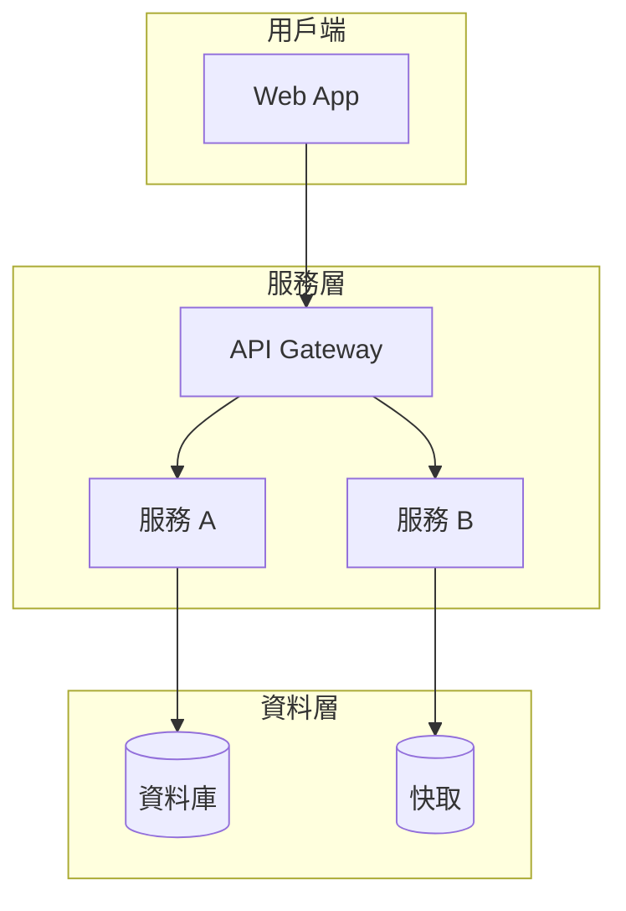

# 架構與設計文件 - [專案名稱]

> **版本:** v1.0 | **更新:** YYYY-MM-DD | **狀態:** 草稿/審核中/已批准

---

## 第 1 部分：架構總覽

### 1.1 C4 模型

- **L1 系統情境圖**: [Mermaid/PlantUML 圖 -- 系統與外部使用者/系統的互動]
- **L2 容器圖**: [可部署單元: Web App, API, DB 等]
- **L3 元件圖**: (選填) [核心容器的內部模組]

### 1.2 DDD 戰略設計

- **通用語言**: [術語詞彙表]
- **限界上下文**: [Context Map -- 業務領域劃分及關係]

### 1.3 分層架構

- **Domain Layer**: 核心業務規則 (Entities, Aggregates)
- **Application Layer**: 應用程式邏輯 (Use Cases/Services)
- **Infrastructure Layer**: 外部互動實現 (DB, API Client)

### 1.4 技術選型

| 分類 | 選用技術 | 選擇理由 | 備選方案 | ADR |
| :--- | :--- | :--- | :--- | :--- |
| 後端框架 | | | | |
| 資料庫 | | | | |
| 快取 | | | | |
| 訊息佇列 | | | | |
| 容器編排 | | | | |
| 可觀測性 | | | | |
| CI/CD | | | | |

---

## 第 2 部分：需求摘要

### 功能性需求

- FR-1: [功能] (對應 US-xxx)
- FR-2: [功能] (對應 US-xxx)

### 非功能性需求

| 分類 | 需求描述 | 目標值 |
| :--- | :--- | :--- |
| 性能 | API P95 延遲 | < 200ms |
| 可擴展性 | | |
| 可用性 (SLA) | | 99.99% |
| 安全性 | | TLS 1.3+, JWT |

---

## 第 3 部分：系統設計

### 3.1 架構模式

- **模式**: [微服務 / 模組化單體 / 事件驅動 / ...]
- **選擇理由**: [簡述]

### 3.2 系統元件圖

### 3.3 元件職責

| 元件 | 核心職責 | 技術 | 依賴 |
| :--- | :--- | :--- | :--- |
| | | | |

### 3.4 關鍵使用者旅程

- **場景 1: [名稱]** -- [步驟 1 → 2 → 3 的資料流描述]
- **場景 2: [名稱]** -- [步驟描述]

---

## 第 4 部分：資料架構

- **資料模型**: [ER 圖或說明]
- **一致性策略**: 強一致: [場景] / 最終一致: [場景]
- **資料分類與合規**: PII 處理方式、加密策略、保留策略

---

## 第 5 部分：部署與基礎設施

- **部署視圖**: [Mermaid 圖]
- **CI/CD 流程**: [提交 → 測試 → 部署的自動化流程]
- **環境策略**: Dev / Staging / Production
- **成本估算**: [主要成本驅動因素與優化策略]

---

## 第 6 部分：跨領域考量

### 可觀測性
- 日誌: [格式/收集方案] | 指標: [SLI/SLO] | 追蹤: [方案] | 告警: [分級]

### 安全性
- 威脅模型 | 認證授權 | 機密管理 | 網路安全

---

## 第 7 部分：風險與演進

### 風險

| 風險 | 可能性 | 影響 | 緩解策略 |
| :--- | :--- | :--- | :--- |
| | | | |

### 演進路線

- **Phase 1 (MVP)**: [範圍與目標]
- **Phase 2 (擴展)**: [範圍與目標]
- **Phase 3 (成熟)**: [範圍與目標]

---

## 第 8 部分：模組詳細設計

### MVP 範圍

- 關鍵模組: [模組 1], [模組 2]
- 後續模組: [模組 3]

### 模組: [名稱]

- **對應 BDD**: [連結]
- **職責**: [簡述]
- **API 設計**: -> 參考 06_api_design_specification.md
- **資料模型**: [Schema 或說明]
- **關鍵邏輯**: [偽碼或流程]

### NFR 實現

- 性能: [策略] | 安全: [策略] | 可擴展: [策略]
