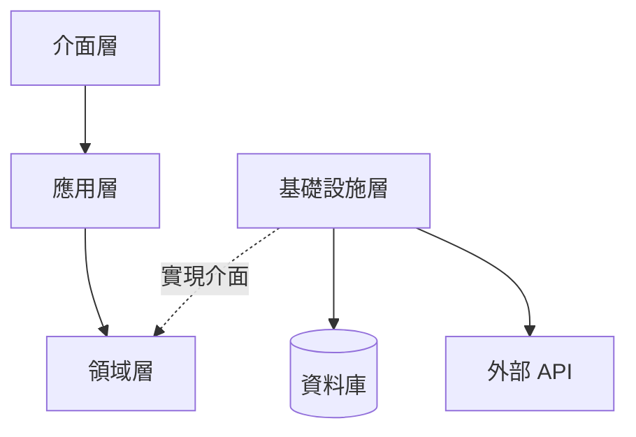

# 模組依賴關係分析 - [專案名稱]

> **版本:** v1.0 | **更新:** YYYY-MM-DD | **狀態:** 草稿/已批准

---

## 依賴原則

| 原則 | 要點 |
| :--- | :--- |
| **依賴倒置 (DIP)** | 高層依賴抽象，不依賴低層實現 |
| **無循環依賴 (ADP)** | 依賴關係形成 DAG，禁止雙向 import |
| **穩定依賴 (SDP)** | 依賴方向朝向更穩定的模組 |

---

## 架構分層依賴圖

**規則**: 介面層 → 應用層 → 領域層 (單向)。基礎設施層實現領域層定義的介面。

---

## 層級職責

| 層級 | 職責 | 程式碼路徑 |
| :--- | :--- | :--- |
| 介面層 | HTTP 處理、API 端點、序列化 | `src/app/api/` |
| 應用層 | 編排業務流程、協調領域與基礎設施 | `src/app/services/` |
| 領域層 | 核心業務邏輯、實體、倉儲介面 | `src/app/domain/` |
| 基礎設施層 | DB 存取、外部服務通信 | `src/app/repositories/` |

---

## 關鍵依賴路徑

**場景**: [例如：建立訂單]

1. `api.orders.create` (介面層) → 接收請求
2. `services.order_service.place_order` (應用層) → 編排流程
3. 建立 `Order` 實體 (領域層) → 業務驗證
4. 呼叫 `OrderRepository` 介面 (領域層定義) → 持久化
5. `postgres_order_repo.save` (基礎設施實現) → DB 操作

---

## 依賴風險管理

| 風險 | 解決策略 |
| :--- | :--- |
| 循環依賴 | 提取共享邏輯至新模組 / 介面提取 / 事件驅動解耦 |
| 不穩定外部依賴 | 適配器模式封裝，內部只依賴穩定介面 |

---

## 外部依賴清單

| 依賴 | 版本 | 用途 | 風險 |
| :--- | :--- | :--- | :--- |
| | | | 低/中/高 |

**更新策略**: [工具名稱] 自動掃描，更新需通過完整 CI 測試。
