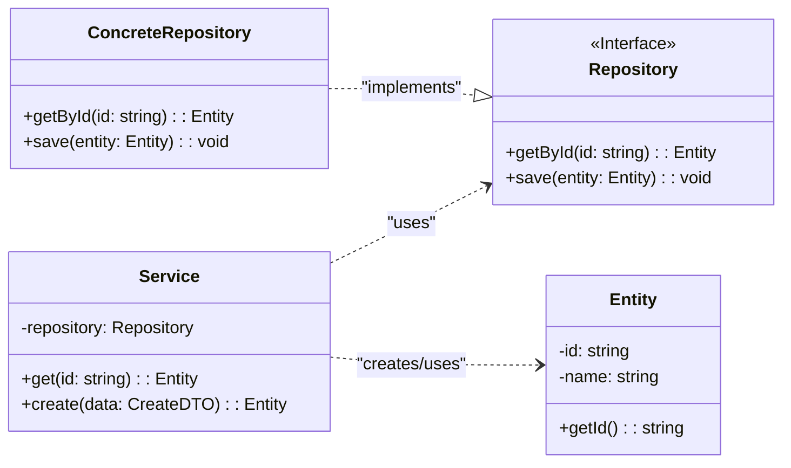

# 類別/元件關係文件 - [專案名稱]

> **版本:** v1.0 | **更新:** YYYY-MM-DD | **狀態:** 草稿/已批准

---

## 核心類別圖

---

## 類別職責

| 類別/元件 | 核心職責 | 協作者 | 所屬層 |
| :--- | :--- | :--- | :--- |
| `Service` | [業務邏輯] | Repository, Entity | Application |
| `Repository` (Interface) | [持久化契約] | Entity | Domain |
| `ConcreteRepository` | [具體 DB 實現] | Entity | Infrastructure |
| `Entity` | [領域模型] | - | Domain |

---

## 關係說明

| 關係類型 | UML 符號 | 範例 |
| :--- | :--- | :--- |
| 繼承 | `--\|>` | 子類別 is-a 父類別 |
| 實現 | `..\|>` | 類別 implements 介面 |
| 組合 | `*--` | 生命週期強綁定 (Order *-- OrderItem) |
| 聚合 | `o--` | 生命週期獨立 |
| 依賴 | `..>` | 方法中使用 (通常透過 DI) |

---

## 設計模式

| 模式 | 應用場景 | 目的 |
| :--- | :--- | :--- |
| 策略模式 | Service 使用 Repository 介面 | 數據存取與業務邏輯解耦 |
| 依賴注入 | Repository 注入 Service | 降低耦合、提高可測試性 |
| | | |

---

## SOLID 原則檢核

- [ ] **S** 單一職責: 每個類別只有一個變更原因
- [ ] **O** 開放封閉: 擴展開放、修改封閉
- [ ] **L** 里氏替換: 子類別可替換父類別
- [ ] **I** 介面隔離: 介面小而專一
- [ ] **D** 依賴反轉: 依賴抽象不依賴實現

---

## 介面契約

### [InterfaceName]

| 方法 | 前置條件 | 後置條件 |
| :--- | :--- | :--- |
| `getById(id)` | id 為有效字串 | 找到返回物件；未找到拋出 NotFoundException |
| `save(entity)` | entity 為有效實例 | 狀態已持久化 |
