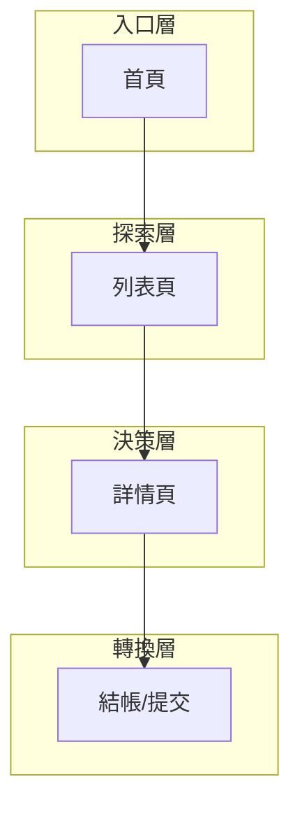

# 前端資訊架構規範 - [專案名稱]

> **版本:** v1.0 | **更新:** YYYY-MM-DD | **狀態:** 草稿/已批准
> **相關文檔:** [PRD](./02_project_brief_and_prd.md) | [前端架構](./12_frontend_architecture_specification.md)

---

## 1. 目的與範圍

**目的**: 定義 [專案名稱] 前端的完整資訊架構，作為開發與設計的 SSOT。

| 範圍 | 說明 |
| :--- | :--- |
| **包含** | 頁面資訊架構、使用者旅程、導航設計、URL 規範、資料傳遞 |
| **不包含** | 視覺設計細節、元件實現、後端 API |

---

## 2. 設計原則

**核心價值主張:** 「[一句話描述為使用者提供的核心價值]」

### 資訊架構原則

| 原則 | 說明 |
| :--- | :--- |
| 簡化 | 保留: [核心功能] / 移除: [排除功能] / 專注: [聚焦點] |
| 認知負荷 | 每頁 1 個主要目標，先總覽再深入 |
| 架構模式 | [ ] 扁平化 / [ ] 層級化 / [ ] 中心輻射 / [ ] 混合 |

---

## 3. 資訊架構總覽

### 系統層次結構

### 頁面總覽

| # | 路由 | 頁面名稱 | 主要職責 | 使用者目標 | 層級 |
| :--- | :--- | :--- | :--- | :--- | :--- |
| 0 | `/` | 首頁 | [職責] | [目標] | L0 |
| 1 | `/[path]` | [名稱] | [職責] | [目標] | L1 |
| 2 | `/[path]` | [名稱] | [職責] | [目標] | L2 |

**總計:** [N] 頁

---

## 4. 核心使用者旅程

### 主要旅程

### 旅程映射表

| 階段 | 頁面 | 使用者心理 | 設計目標 | 主要 CTA | 轉換率目標 |
| :--- | :--- | :--- | :--- | :--- | :--- |
| [階段名] | [頁面] | [心理描述] | [目標] | [CTA] | [%] |

---

## 5. 導航結構

### 主導航

| 項目 | 連結 | 顯示條件 |
| :--- | :--- | :--- |
| [名稱] | `/path` | 永遠顯示 |
| [名稱] | `/path` | 登入後 |

### 輔助導航
- 麵包屑: [規則]
- Footer 導航: [內容]
- 側邊欄: [適用頁面]

---

## 6. 頁面規格

### 頁面: [名稱]

| 項目 | 內容 |
| :--- | :--- |
| **路由** | `/path` |
| **職責** | [單一職責描述] |
| **資料需求** | [需要的 API / Store 資料] |
| **使用者行動** | [主要 CTA 與次要行動] |
| **導航入口** | [從哪些頁面進入] |
| **導航出口** | [可前往哪些頁面] |

_(為每個核心頁面複製上方表格)_

---

## 7. URL 結構與路由

### 命名規範
- 小寫、連字符分隔: `/user-profile`
- 資源 ID: `/resources/:id`
- 巢狀資源: `/users/:userId/orders/:orderId`
- 查詢參數用於過濾/排序: `?status=active&sort=-created`

### 路由表

| 路由 | 元件 | 認證 | 載入策略 |
| :--- | :--- | :--- | :--- |
| `/` | HomePage | 否 | 預載 |
| `/login` | LoginPage | 否 | 懶載入 |
| `/dashboard` | DashboardPage | 是 | 懶載入 |

---

## 8. 資料流與狀態

### 頁面間資料傳遞

| 來源頁面 | 目標頁面 | 傳遞方式 | 資料內容 |
| :--- | :--- | :--- | :--- |
| [頁面A] | [頁面B] | URL params / Store / Props | [資料描述] |

---

## 9. 檢查清單

### 資訊架構
- [ ] 所有頁面已定義職責與使用者目標
- [ ] 核心使用者旅程已映射
- [ ] 導航結構清晰且一致
- [ ] URL 結構語義化且 SEO 友善

### 可用性
- [ ] 導航深度 <= 3 層
- [ ] 每頁只有 1 個主要 CTA
- [ ] 麵包屑導航可回溯
- [ ] 404/錯誤頁面有引導
