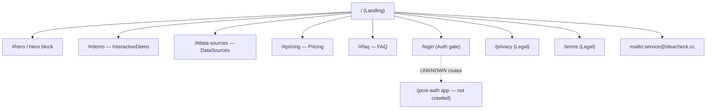

# L4 Sitemap — ideacheck.cc

- **Source URL**: https://ideacheck.cc/
- **Capture date**: 2026-04-08
- **Method**: Static HTML (`curl -A "Mozilla/5.0" https://ideacheck.cc/`), nav + footer link extraction. No deeper crawl performed.

## Route graph

## Route categorization

| Page / Anchor | Public / Auth | Purpose | Observed from |
| :--- | :--- | :--- | :--- |
| `/` | Public | Marketing landing (single page) | Document root |
| `/#demo` | Public | InteractiveDemo section anchor | Top nav |
| `/#data-sources` | Public | DataSources credibility section | Top nav |
| `/#pricing` | Public | Pricing tiers section | Top nav |
| `/#faq` | Public | FAQ section | Top nav |
| `/login` | Auth gate | Sign-in entry to app | Top nav button |
| `/privacy` | Public | Privacy policy | Footer |
| `/terms` | Public | Terms of service | Footer |
| `mailto:service@ideacheck.cc` | Public | Contact channel | Footer |

## Functional zoning

| Zone | Members |
| :--- | :--- |
| Marketing | `/` and all `#` anchors (`#demo`, `#data-sources`, `#pricing`, `#faq`) |
| Legal | `/privacy`, `/terms` |
| Auth | `/login` |
| Contact | `mailto:service@ideacheck.cc` |

## Findings & notes

- **`noindex` meta present**: The static HTML head contains a `noindex` robots directive — the team does not want the site indexed by search engines yet. This is worth flagging for any SEO/launch checklist downstream; clones should not inherit this unless intentional.
- **Single-page marketing site**: No blog, docs, changelog, or knowledge-base routes appear in the nav or footer. The marketing surface is exactly one document with section anchors plus two legal pages.
- **App routes are opaque**: Anything past `/login` was not crawled and is treated as UNKNOWN. The L4 only reflects what is reachable from the public landing.

## Confidence

| Scope | Confidence |
| :--- | :--- |
| Listed marketing/legal/login routes | HIGH — all extracted from static HTML nav + footer |
| Existence of post-auth routes | UNKNOWN — intentionally not crawled |
| Existence of additional public routes (blog/docs) | HIGH that none exist — absent from full nav + footer |

## Cross-reference: shipyouridea.today

`shipyouridea.today` has the same overall structural pattern (single-page marketing + legal pages + login), but its top nav is reduced to **範例 / 價格 / FAQ** only — there is **no `#data-sources` anchor** because the credibility/data-sources section is not surfaced in its nav. Footer legal + contact pattern is equivalent. When porting components or section ordering between the two clones, treat `DataSources` as ideacheck-specific.
