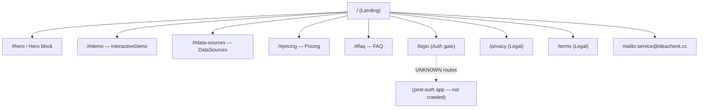

# L4 Sitemap — ideacheck.cc

- **來源 URL**：https://ideacheck.cc/
- **擷取日期**：2026-04-08
- **方法**：Static HTML（`curl -A "Mozilla/5.0" https://ideacheck.cc/`），nav + footer 連結萃取。未執行更深層的 crawl。

## Route graph

## Route 分類

| Page / Anchor | Public / Auth | 用途 | 觀察來源 |
| :--- | :--- | :--- | :--- |
| `/` | Public | Marketing landing（單頁） | 文件根 |
| `/#demo` | Public | InteractiveDemo section anchor | Top nav |
| `/#data-sources` | Public | DataSources 可信度 section | Top nav |
| `/#pricing` | Public | Pricing tiers section | Top nav |
| `/#faq` | Public | FAQ section | Top nav |
| `/login` | Auth gate | 進入 app 的登入入口 | Top nav 按鈕 |
| `/privacy` | Public | 隱私權政策 | Footer |
| `/terms` | Public | 服務條款 | Footer |
| `mailto:service@ideacheck.cc` | Public | 聯絡管道 | Footer |

## 功能分區（Functional zoning）

| Zone | 成員 |
| :--- | :--- |
| Marketing | `/` 與所有 `#` anchors（`#demo`、`#data-sources`、`#pricing`、`#faq`） |
| Legal | `/privacy`、`/terms` |
| Auth | `/login` |
| Contact | `mailto:service@ideacheck.cc` |

## 發現與備註

- **存在 `noindex` meta**：static HTML head 包含 `noindex` robots 指令 — 團隊目前不希望此站被搜尋引擎索引。對於後續任何 SEO / 上線 checklist 都值得標記；clone 不應無意間繼承此設定。
- **單頁行銷站**：nav 或 footer 中未出現 blog、docs、changelog 或 knowledge-base 路由。行銷介面剛好就是一份含 section anchors 的文件加上兩個法律頁面。
- **App 路由不透明**：`/login` 之後的內容未被 crawl，視為 UNKNOWN。L4 僅反映從公開 landing 可達的範圍。

## 信心度

| 範圍 | 信心度 |
| :--- | :--- |
| 列出的 marketing / legal / login 路由 | HIGH — 全部從 static HTML nav + footer 萃取 |
| Post-auth 路由是否存在 | UNKNOWN — 刻意未 crawl |
| 是否存在其他公開路由（blog / docs） | HIGH 確認不存在 — 完整 nav + footer 均未出現 |

## 交叉參照：shipyouridea.today

`shipyouridea.today` 具有相同的整體結構 pattern（單頁行銷 + 法律頁 + 登入），但其 top nav 僅縮減為 **範例 / 價格 / FAQ** — 沒有 `#data-sources` anchor，因為 credibility / data-sources section 並未出現在其 nav。Footer 的法律 + 聯絡 pattern 則相同。在兩個 clone 之間移植元件或 section 順序時，`DataSources` 應視為 ideacheck 專屬。
