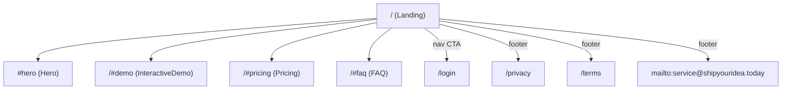

# L4 Sitemap — ShipYourIdea

- **來源**：https://shipyouridea.today/
- **擷取日期**：2026-04-08
- **信心度**：HIGH（route 從 static HTML nav + footer 觀察取得）

## Route Map

## Route 分類

| Page | Public / Auth | 用途 | 觀察來源 |
| :--- | :--- | :--- | :--- |
| `/` | Public | Marketing landing（Hero、InteractiveDemo、Pricing、FAQ） | Server-rendered HTML root |
| `/#demo` | Public anchor | 跳至 InteractiveDemo section | Top nav 連結 |
| `/#pricing` | Public anchor | 跳至 Pricing section | Top nav + footer 連結 |
| `/#faq` | Public anchor | 跳至 FAQ section | Top nav + footer 連結 |
| `/login` | Auth 入口 | 登入頁（CTA 按鈕目的地） | Top nav 按鈕 |
| `/privacy` | Public | 隱私權政策 | Footer 連結 |
| `/terms` | Public | 服務條款 | Footer 連結 |
| `mailto:service@shipyouridea.today` | Public | 聯絡 email | Footer 連結 |

## 功能分區（Functional Zoning）

- **Marketing**：`/`（含 Hero / InteractiveDemo / Pricing / FAQ sections 的單頁）
- **Legal**：`/privacy`、`/terms`
- **Auth**：`/login`
- **Contact**：`mailto:service@shipyouridea.today`

## 備註

- Static HTML 中存在 `<meta name="robots" content="noindex">` — 站點要求搜尋引擎不要索引。
- 單頁 marketing 架構；未觀察到 blog、docs、changelog 等路由。
- 本站不存在 `#data-sources` anchor。
- Contact 使用本站自身網域的 `mailto:`。

## 與 ideacheck.cc 的差異

與 ideacheck.cc 的 route 結構相同，只是少了 `#data-sources` anchor。Sitemap 規模少一個 anchor。TLD 也不同（`.today` vs `.cc`）。Contact email 使用自家網域。
